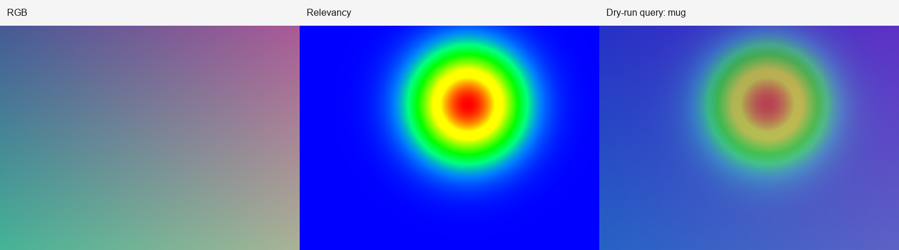
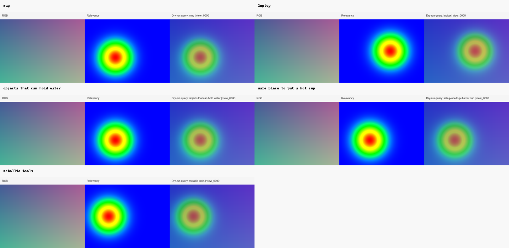
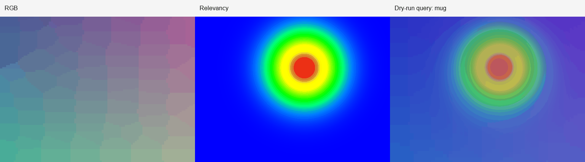
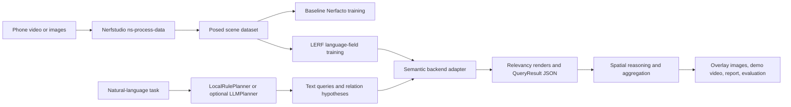

# NeRF-LLM Scene Inspector

Open-Vocabulary 3D Scene Understanding from Phone Video.

This is a research engineering project built on Nerfstudio and LERF. It reconstructs a real scene from monocular video or images, trains a language-embedded radiance field, and exposes natural-language scene queries with structured artifacts, overlays, and lightweight evaluation. LERF is the primary semantic backend; OpenNeRF is included as an optional secondary adapter.


## Demo Preview

The checked-in preview below is generated in dry-run mode, so it is a synthetic visualization rather than a trained LERF result. It shows the exact artifact shape the real pipeline produces: RGB render, text-query relevancy heatmap, and an overlay panel.







## One-Command Demo

Run the full GPU-free smoke demo:

```bash
python scripts/run_dry_run_demo.py
```

This creates mock Nerfstudio data, mock training summaries, semantic query overlays, a GIF montage, evaluation JSON/CSV, and an updated project report. Full real-scene training still requires Nerfstudio, LERF, CUDA-compatible PyTorch, COLMAP, FFmpeg, and an NVIDIA GPU.

## Why This Is AI-Relevant

The project connects four active research areas:

- Neural radiance fields and 3D reconstruction.
- Vision-language feature distillation with CLIP/VLM embeddings.
- Open-vocabulary object localization in 3D scenes.
- Lightweight language planning for semantic and spatial scene questions.

It is designed as a portfolio-quality system rather than a paper novelty claim.

## Research Positioning

- **Neural radiance fields:** Nerfstudio wrappers handle posed data preparation and baseline NeRF training.
- **Vision-language feature distillation:** LERF-style backends expose CLIP/VLM-aligned relevancy outputs for text prompts.
- **Open-vocabulary 3D localization:** Queries are not limited to a fixed class set; the system records rendered relevancy artifacts and approximate regions.
- **LLM-style query planning:** A deterministic local planner expands natural-language tasks into object, material, affordance, and relation prompts without requiring an API.
- **Embodied AI relevance:** The project explores how persistent scene representations can connect geometry, language, objects, affordances, and physical context.

## Implemented Now

- CPU-safe CLI wrappers for data preparation, baseline training, language-field training, querying, demo generation, evaluation, and environment checks.
- LERF primary backend with dry-run multi-view artifacts, best-effort internal rendering, strict mode, and manual viewer fallback templates.
- Optional OpenNeRF adapter scaffold.
- Typed JSON artifacts for query results and scene reports.
- Deterministic query planner covering object search, affordances, materials, spatial relations, and scene-level semantic expansion.
- Spatial/evaluation utilities for boxes, relevancy ranking, 2D fallback relations, and qualitative reports.
- Annotation review artifacts that draw manual `bbox_2d` labels over rendered views for QA before reporting metrics.
- Capture manifests that record device, lighting, motion, overlap, static-scene, and privacy-review metadata, then feed those checks into audit/recommendation/evidence gates.
- Real-scene data inspection for `transforms.json`, frame paths, pose matrices, and training readiness.
- Real-run preflight reports that check raw input, processed scene data, config paths, CUDA/upstream tools, and backend method registration before expensive training.
- Practical one-command pipeline runner that records environment, git/runtime provenance, data, training, query, demo, and evaluation steps.
- Run-level recommendation reports that turn audit, environment, scene, annotation, and evaluation signals into concrete next actions.
- Evidence scorecards that rate a run's portfolio-readiness across pipeline integrity, capture metadata, environment, scene quality, query outputs, annotations, and presentation artifacts without claiming model performance superiority.
- Multi-run comparison reports that rank repeated captures/training attempts and identify the strongest real-run portfolio candidate.
- Static project-level portfolio site under `docs/index.html` for GitHub Pages or local review.
- Static run-level portfolio pages that summarize evidence, metrics, visual artifacts, and links in a shareable HTML file.
- Reproduction manifests and replay scripts generated from each pipeline run for shareable experiment recipes.
- Shareable portfolio-pack export and validation that checks required artifacts, artifact links, and local path leakage before sharing.
- GitHub Actions CI for tests, CLI help checks, environment diagnostics, and dry-run demo.

## Not Claimed

- This is not a new NeRF architecture.
- This is not a state-of-the-art segmentation or detection model.
- This is not a robotics manipulation policy.
- Dry-run outputs are synthetic and validate pipeline behavior only.
- Real LERF quality depends on capture quality, COLMAP poses, GPU training, and upstream Nerfstudio/LERF versions.

## Architecture



## Installation

Create a Python environment for the project wrappers:

```bash
cd nerf-llm-scene-inspector
python -m pip install -e ".[dev,video]"
```

Check the local environment:

```bash
python scripts/check_env.py --verbose
python scripts/check_env.py --json
python scripts/preflight_real_run.py --input examples --type images --no-check-upstream --dry-run --allow-warnings
```

Full reconstruction and training require Nerfstudio, LERF, CUDA-compatible PyTorch, Tiny CUDA NN, COLMAP, FFmpeg, and an NVIDIA GPU. The helper script prints a complete setup path:

```bash
bash scripts/setup_env.sh
```

Core upstream install commands:

```bash
conda create -n nerf-llm-scene-inspector python=3.10 -y
conda activate nerf-llm-scene-inspector
python -m pip install --upgrade pip
python -m pip install nerfstudio
ns-install-cli

git clone https://github.com/kerrj/lerf
cd lerf
python -m pip install -e .
ns-install-cli
ns-train -h
```

`ns-train -h` should list `lerf`, `lerf-lite`, and `lerf-big`.

## Phone Video Capture Advice

- Move slowly with high frame overlap.
- Keep the scene static.
- Avoid motion blur and reflective-only surfaces.
- Use good, even lighting.
- Capture from multiple heights and angles.
- Prefer 30 to 90 seconds for a small desk-scale scene.

## End-To-End Workflow

Five-minute CPU-only dry-run demo:

```bash
python scripts/run_dry_run_demo.py
```

Practical one-command dry-run pipeline:

```bash
python scripts/run_scene_pipeline.py --dry-run
python scripts/create_capture_manifest.py --input examples --type images --scene-name desk_scene --output results/capture_manifest --allow-warnings
python scripts/audit_run.py --run-dir results/pipeline_runs/desk_scene
python scripts/recommend_next_steps.py --run-dir results/pipeline_runs/desk_scene
python scripts/create_evidence_scorecard.py --run-dir results/pipeline_runs/desk_scene
python scripts/generate_portfolio_page.py --run-dir results/pipeline_runs/desk_scene
python scripts/create_reproduction_bundle.py --run-dir results/pipeline_runs/desk_scene
python scripts/index_runs.py --root results/pipeline_runs
python scripts/compare_runs.py --root results/pipeline_runs
python scripts/generate_project_site.py --run-index results/pipeline_runs/run_index.json
```

This writes a reproducible pipeline record to `results/pipeline_runs/desk_scene/pipeline_summary.json`.
Each pipeline run writes run-scoped query, demo, evaluation, and report artifacts under
`results/pipeline_runs/<scene>/`. Existing run-scoped query/demo/evaluation folders are
cleaned by default to avoid stale results; pass `--no-clean-run` only when you intentionally
want to preserve prior files.
Full command stdout/stderr logs are saved under `results/pipeline_runs/<scene>/logs/`
for debugging Nerfstudio, LERF, annotation, demo, and evaluation failures.

Export the latest run into a shareable portfolio package:

```bash
python scripts/export_portfolio_pack.py --run-dir results/pipeline_runs/desk_scene --zip
python scripts/validate_portfolio_pack.py --pack results/portfolio_pack
```

The validation step verifies that required project/run artifacts exist, indexed artifact paths
resolve inside the pack, and text/JSON files do not leak user-home, temporary, or CI workspace
directories.

Dry-run mode creates mock metadata and artifacts without requiring a GPU:

```bash
python scripts/prepare_data.py --input examples --output data/processed/desk_scene --type images --dry-run
python scripts/inspect_scene_data.py --data data/processed/desk_scene --min-frames 1 --min-pose-extent 0.01 --allow-warnings
python scripts/train_baseline_nerf.py --data data/processed/desk_scene --method nerfacto --output runs/baseline_desk_scene --dry-run
python scripts/train_language_field.py --data data/processed/desk_scene --backend lerf --variant lerf-lite --output runs/language_desk_scene --dry-run
python scripts/query_scene.py --config runs/language_desk_scene/config.yml --backend lerf --query "Find objects related to making coffee." --output results/query_outputs --dry-run
python scripts/create_annotation_template.py --queries examples/queries_demo.yaml --results results/query_outputs --output results/annotations_template.json --overwrite
python scripts/validate_annotations.py --annotations examples/annotations_example.json --queries examples/queries_demo.yaml --results results/query_outputs
python scripts/review_annotations.py --annotations examples/annotations_example.json --results results/query_outputs --output results/evaluation --allow-warnings
python scripts/generate_demo_assets.py --config runs/language_desk_scene/config.yml --backend lerf --dry-run
python scripts/evaluate_queries.py --queries examples/queries_demo.yaml --annotations examples/annotations_example.json --results results/demo_assets --dry-run
```

Real mode uses the installed upstream tools:

```bash
python scripts/preflight_real_run.py --input path/to/video.mp4 --type video --require-gpu --allow-warnings
python scripts/create_capture_manifest.py --input path/to/video.mp4 --type video --scene-name desk_scene --capture-device "phone model" --lighting "bright diffuse indoor" --camera-motion "slow orbit" --static-scene --high-overlap --privacy-reviewed --output results/capture_manifest
python scripts/prepare_data.py --input path/to/video.mp4 --output data/processed/desk_scene --type video
python scripts/preflight_real_run.py --input path/to/video.mp4 --type video --capture-manifest results/capture_manifest/capture_manifest.json --data data/processed/desk_scene --require-gpu
python scripts/inspect_scene_data.py --data data/processed/desk_scene --min-frames 50 --min-pose-extent 0.05
python scripts/train_baseline_nerf.py --data data/processed/desk_scene --method nerfacto --output runs/baseline_desk_scene
python scripts/train_language_field.py --data data/processed/desk_scene --backend lerf --variant lerf-lite --output runs/language_desk_scene
python scripts/query_scene.py --config path/to/config.yml --backend lerf --query "mug" --output results/query_outputs --num-views 3
python scripts/create_annotation_template.py --queries examples/queries_demo.yaml --results results/query_outputs --output results/annotations_template.json --overwrite
python scripts/validate_annotations.py --annotations results/annotations_template.json --queries examples/queries_demo.yaml --results results/query_outputs
python scripts/review_annotations.py --annotations results/annotations_template.json --results results/query_outputs --output results/evaluation --allow-warnings
streamlit run src/nerf_llm_scene_inspector/visualization/dashboard.py
python scripts/evaluate_queries.py --queries examples/queries_demo.yaml --annotations examples/annotations_example.json --results results/query_outputs
```

Localization metrics such as `top_k_hit_rate` and `mean_iou_2d` are computed only for
queries with manual `bbox_2d` annotations. Queries without bbox annotations are retained in
the qualitative table as `unannotated` or `qualitative_only_no_bbox` instead of being counted
as localization failures. If the same visual prompt appears in multiple expanded tasks, the
CSV keeps all rows while summary metrics use the best row per unique query.

The dashboard can review an existing `results/pipeline_runs/<scene>` directory without
starting a new query. It shows pipeline status, provenance, scene data inspection, visual
artifacts, query reports, annotation templates, evaluation metrics, and the multi-run
comparison report used to choose a portfolio candidate. Install it with:

```bash
python -m pip install -e ".[dashboard]"
streamlit run src/nerf_llm_scene_inspector/visualization/dashboard.py
```

One-command real-scene pipeline after upstream tools are installed:

```bash
python scripts/run_scene_pipeline.py \
  --input path/to/video.mp4 \
  --scene-name desk_scene \
  --type video \
  --capture-manifest results/capture_manifest/capture_manifest.json \
  --backend lerf \
  --variant lerf-lite \
  --query "mug" \
  --query "objects that can hold water" \
  --annotations examples/annotations_example.json \
  --num-views 3 \
  --min-pose-extent 0.05 \
  --strict
```

Launch the Nerfstudio viewer for a trained run:

```bash
ns-viewer --load-config path/to/config.yml
```

For LERF, enter a text prompt in the viewer and select `relevancy_0` or `composited_0`.
If automated LERF rendering falls back to the viewer workflow, save images with names such
as `view_0000_rgb.png`, `view_0000_relevancy.png`, and `view_0000_overlay.png`, then import
them back into the standard query schema:

```bash
python scripts/import_viewer_outputs.py --query "mug" --config path/to/config.yml --input results/manual_viewer/mug --output results/query_outputs/mug
```

## Expected Outputs

- `data/processed/<scene>/transforms.json`
- `data/processed/<scene>/scene_inspector_metadata.json`
- `results/pipeline_runs/<scene>/preflight_report.json`
- `results/pipeline_runs/<scene>/capture_manifest.json`
- `results/pipeline_runs/<scene>/capture_manifest.md`
- `results/pipeline_runs/<scene>/capture_manifest_validation.json`
- `results/pipeline_runs/<scene>/capture_manifest_validation.md`
- `results/pipeline_runs/<scene>/preflight_report.md`
- `results/pipeline_runs/<scene>/pipeline_summary.json`
- `results/pipeline_runs/<scene>/scene_data_inspection.json`
- `results/pipeline_runs/<scene>/scene_data_inspection.md`
- `results/pipeline_runs/<scene>/training/baseline_train_summary.json`
- `results/pipeline_runs/<scene>/training/language_train_summary.json`
- `results/pipeline_runs/<scene>/queries/<query>/scene_query_report.json`
- `results/pipeline_runs/<scene>/annotation_template.json`
- `results/pipeline_runs/<scene>/demo_assets/query_grid.png`
- `results/pipeline_runs/<scene>/evaluation/annotation_validation.json`
- `results/pipeline_runs/<scene>/evaluation/annotation_review.json`
- `results/pipeline_runs/<scene>/evaluation/annotation_review.md`
- `results/pipeline_runs/<scene>/evaluation/annotation_review_contact_sheet.png`
- `results/pipeline_runs/<scene>/evaluation/eval_summary.json`
- `results/pipeline_runs/<scene>/run_audit.json`
- `results/pipeline_runs/<scene>/run_audit.md`
- `results/pipeline_runs/<scene>/run_recommendations.json`
- `results/pipeline_runs/<scene>/run_recommendations.md`
- `results/pipeline_runs/<scene>/evidence_scorecard.json`
- `results/pipeline_runs/<scene>/evidence_scorecard.md`
- `results/pipeline_runs/<scene>/portfolio_page.html`
- `results/pipeline_runs/<scene>/reproduction_manifest.json`
- `results/pipeline_runs/<scene>/reproduction_report.md`
- `results/pipeline_runs/<scene>/reproduce_run.sh`
- `results/pipeline_runs/run_index.json`
- `results/pipeline_runs/run_index.md`
- `results/pipeline_runs/run_comparison.json`
- `results/pipeline_runs/run_comparison.md`
- `docs/index.html`
- `results/pipeline_runs/<scene>/logs/*.json`
- `results/pipeline_runs/<scene>/project_report.md`
- `results/pipeline_runs/<scene>/portfolio_result_card.md`
- `results/portfolio_pack/portfolio_pack_index.json`
- `results/portfolio_pack/portfolio_pack_validation.json`
- `results/portfolio_pack.zip`

`scene_data_inspection` includes frame counts, missing images, invalid pose counts, camera
translation extent, approximate path length, duplicate adjacent poses, and a pose coverage
score. Low pose coverage usually means the camera rotated in place or COLMAP could not recover
enough parallax for reliable training.
Each `scene_query_report.json` stores the originating scene name and uses stable slugged query
directories so query artifacts remain traceable across repeated runs.
- `results/<run_name>/train_summary.json`
- `results/query_outputs/<query_id>/query_result.json`
- Overlay images combining RGB render, relevancy heatmap, and query caption.
- `results/demo_assets/query_grid.png`
- `results/demo_assets/demo_montage.gif`
- `results/evaluation/eval_summary.json`
- `results/evaluation/eval_table.csv`
- `results/evaluation/qualitative_report.md`
- `docs/project_report.md`
- `docs/portfolio_result_card.md`

Portfolio-facing docs:

- [Portfolio result card](docs/portfolio_result_card.md)
- [Static project page](docs/index.html)
- [CV bullets](docs/cv_bullets.md)
- [Cold-email paragraphs](docs/cold_email_paragraph.md)
- [Real scene capture checklist](docs/real_scene_capture_checklist.md)
- [Real-run reproducibility notes](docs/real_run_reproducibility.md)

## Reproducibility

Every `run_scene_pipeline.py` execution writes a `provenance` block inside
`results/pipeline_runs/<scene>/pipeline_summary.json`. It records the project version,
Python/platform details, the CLI command, git commit, branch, dirty state, and sanitized
remote URL when available. The exported portfolio pack keeps a share-safe provenance excerpt
in `portfolio_pack_index.json` and sanitizes machine-specific paths in the packaged summary.

## LERF Query Rendering

Upstream LERF stores positive prompts on the image encoder through `set_positives(...)` and renders `relevancy_0`/`composited_0` outputs in evaluation. This project attempts to load a trained config through Nerfstudio/LERF internals, set the prompt programmatically, and save the rendered outputs. If installed versions expose incompatible internal APIs, the CLI falls back to a structured query report and viewer workflow. The `import_viewer_outputs.py` helper converts manually saved viewer images into `query_result.json`, extracts image-space boxes from relevancy maps, and keeps evaluation/reporting usable.

## Testing

The tests do not require GPU, Nerfstudio, LERF, or trained checkpoints:

```bash
pytest
python scripts/check_env.py --json
python scripts/create_capture_manifest.py --help
python scripts/preflight_real_run.py --help
python scripts/run_dry_run_demo.py
python scripts/run_scene_pipeline.py --dry-run --query mug
python scripts/prepare_data.py --help
python scripts/inspect_scene_data.py --help
python scripts/train_baseline_nerf.py --help
python scripts/train_language_field.py --help
python scripts/query_scene.py --help
python scripts/import_viewer_outputs.py --help
python scripts/create_annotation_template.py --help
python scripts/validate_annotations.py --help
python scripts/review_annotations.py --help
python scripts/generate_demo_assets.py --help
python scripts/generate_portfolio_page.py --help
python scripts/generate_project_site.py --help
python scripts/evaluate_queries.py --help
python scripts/audit_run.py --help
python scripts/recommend_next_steps.py --help
python scripts/create_evidence_scorecard.py --help
python scripts/create_reproduction_bundle.py --help
python scripts/index_runs.py --help
python scripts/compare_runs.py --help
python scripts/export_portfolio_pack.py --help
python scripts/validate_portfolio_pack.py --help
python scripts/run_scene_pipeline.py --help
python scripts/export_portfolio_pack.py --run-dir results/pipeline_runs/desk_scene --zip
python scripts/validate_portfolio_pack.py --pack results/portfolio_pack
```

If `ruff` is installed:

```bash
ruff check .
```

## CV Description

Conservative one-line version:

> Developed a reproducible research engineering project built on Nerfstudio and LERF-style methods for exploring open-vocabulary 3D scene querying from captured images/video.

## Limitations

- Automated LERF rendering depends on Nerfstudio/LERF internal APIs that may vary across versions.
- Dry-run artifacts are synthetic and only verify pipeline behavior.
- 3D point localization is approximate unless the backend exposes sampled 3D positions.
- Spatial reasoning is heuristic and reports when it falls back to 2D image-space evidence.
- OpenNeRF support is secondary and may require adapter updates for a specific checkout.

## Future Work

- Harden the OpenNeRF backend for multiple repository revisions.
- Add RelationField-style relation prediction for support, containment, and interaction queries.
- Connect query results to robotics manipulation policies.
- Support lifelong semantic scene updates across repeated captures.
- Add Gaussian splatting acceleration for faster rendering and interaction.

## Upstream Repositories

- Nerfstudio: https://github.com/nerfstudio-project/nerfstudio
- LERF: https://github.com/kerrj/lerf
- OpenNeRF: https://github.com/opennerf/opennerf
- RelationField reference: https://github.com/boschresearch/RelationField
