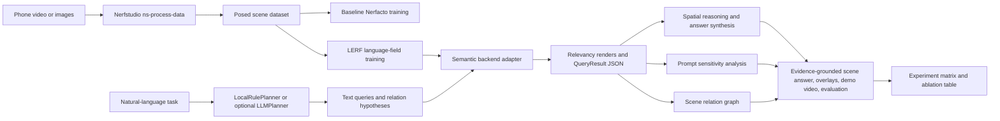

# NeRF-LLM Scene Inspector

Open-Vocabulary 3D Scene Understanding from Phone Video.

This is a research engineering project built on Nerfstudio and LERF. It reconstructs a real scene from monocular video or images, trains a language-embedded radiance field, and exposes natural-language scene queries with structured artifacts, overlays, and lightweight evaluation. LERF is the primary semantic backend; OpenNeRF is included as an optional secondary adapter.


## Demo Preview

The checked-in preview below is generated in dry-run mode, so it is a synthetic visualization rather than a trained LERF result. It shows the exact artifact shape the real pipeline produces: RGB render, text-query relevancy heatmap, and an overlay panel.


## One-Command Demo

Run the full GPU-free smoke demo:

```bash
python scripts/run_dry_run_demo.py
```

This creates mock Nerfstudio data, mock training summaries, semantic query overlays, a GIF montage, evaluation JSON/CSV, and an updated project report. Full real-scene training still requires Nerfstudio, LERF, CUDA-compatible PyTorch, COLMAP, FFmpeg, and an NVIDIA GPU.

## Why This Is AI-Relevant

The project connects four active research areas:

- Neural radiance fields and 3D reconstruction.
- Vision-language feature distillation with CLIP/VLM embeddings.
- Open-vocabulary object localization in 3D scenes.
- Lightweight language planning for semantic and spatial scene questions.

It is designed as a portfolio-quality system rather than a paper novelty claim.

## Research Positioning

- **Neural radiance fields:** Nerfstudio wrappers handle posed data preparation and baseline NeRF training.
- **Vision-language feature distillation:** LERF-style backends expose CLIP/VLM-aligned relevancy outputs for text prompts.
- **Open-vocabulary 3D localization:** Queries are not limited to a fixed class set; the system records rendered relevancy artifacts and approximate regions.
- **LLM-style query planning:** A deterministic local planner expands natural-language tasks into object, material, affordance, and relation prompts, records intent tags and relation anchors, and does not require an API.
- **Embodied AI relevance:** The project explores how persistent scene representations can connect geometry, language, objects, affordances, and physical context.

## Implemented Now

- CPU-safe CLI wrappers for data preparation, baseline training, language-field training, querying, demo generation, evaluation, and environment checks.
- LERF primary backend with dry-run multi-view artifacts, best-effort internal rendering, strict mode, and manual viewer fallback templates.
- Manual viewer-output import and scene-query report repair for recovering structured evidence after interactive LERF fallback.
- OpenNeRF secondary adapter with multi-view dry-run artifacts, strict mode, viewer fallback, and manual repair workflow.
- Typed JSON artifacts for query results and scene reports.
- Deterministic query planner covering targeted object search, affordances, materials, spatial relations, scene-level semantic expansion, intent tags, and relation-anchor metadata.
- Spatial/evaluation utilities for boxes, relevancy ranking, 2D fallback relations, and qualitative reports.
- Scene-relation graph analysis that converts saved query regions/points into entity lists, relation edges, CSV tables, and Markdown reports with explicit `2d_fallback` or `3d` evidence tags.
- Annotation templates, an offline bbox annotation workbench, merge/finalize tooling for filled workbench exports, and review artifacts for QA before reporting metrics.
- Prompt-sensitivity analysis that checks whether wording variants retrieve consistent regions, views, and relevancy scores.
- Capture manifests that record device, lighting, motion, overlap, static-scene, and privacy-review metadata, then feed those checks into audit/recommendation/evidence gates.
- Real-scene data inspection for `transforms.json`, frame paths, pose matrices, and training readiness.
- Real-run preflight reports that check raw input, processed scene data, config paths, CUDA/upstream tools, and backend method registration before expensive training.
- Failure diagnostics that classify saved command logs and training/query artifacts into actionable CUDA, Nerfstudio, LERF, COLMAP, FFmpeg, config, and viewer-fallback repair steps.
- Practical one-command pipeline runner that records environment, git/runtime provenance, data, training, query, demo, and evaluation steps.
- Run-level recommendation reports that turn audit, environment, scene, annotation, and evaluation signals into concrete next actions.
- Evidence scorecards that rate a run's portfolio-readiness across pipeline integrity, capture metadata, environment, scene quality, query outputs, annotations, and presentation artifacts without claiming model performance superiority.
- Run readiness gates that summarize whether the run is ready to start real GPU training and whether the evidence is ready for external review.
- Multi-run comparison reports that rank repeated captures/training attempts and identify the strongest real-run portfolio candidate.
- Experiment-matrix runner for small ablations across backends, variants, query sets, prompt-sensitivity suites, and relation-analysis settings.
- Static project-level portfolio site under `docs/index.html` for GitHub Pages or local review.
- Static run-level portfolio pages that summarize evidence, metrics, visual artifacts, sharing readiness, and links in a shareable HTML file.
- Reproduction manifests and replay scripts generated from each pipeline run for shareable experiment recipes.
- Shareable portfolio-pack export and validation that checks required artifacts, artifact links, and local path leakage before sharing.
- Submission packets that turn a validated run into a claim-calibrated CV/professor-outreach checklist with allowed claims, claims to avoid, and next actions.
- Run result cards that condense one run into a reviewer-facing takeaway, evidence snapshot, metrics, caveats, and safe sharing language.
- Real-run action plans that convert a smoke run into concrete capture, GPU training, annotation, quality-gate, portfolio-pack, and professor-outreach commands.
- Claim-audit reports that scan portfolio-facing text for unsupported SOTA, novelty, benchmark, production, or robotics-policy claims before sharing.
- GitHub Actions CI for tests, CLI help checks, environment diagnostics, and dry-run demo.

## Not Claimed

- This is not a new NeRF architecture.
- This is not a state-of-the-art segmentation or detection model.
- This is not a robotics manipulation policy.
- Dry-run outputs are synthetic and validate pipeline behavior only.
- Real LERF quality depends on capture quality, COLMAP poses, GPU training, and upstream Nerfstudio/LERF versions.

## Architecture



## Installation

Create a Python environment for the project wrappers:

```bash
cd nerf-llm-scene-inspector
python -m pip install -e ".[dev,video]"
```

Check the local environment:

```bash
python scripts/check_env.py --verbose
python scripts/check_env.py --json
python scripts/preflight_real_run.py --input examples --type images --no-check-upstream --dry-run --allow-warnings
```

Full reconstruction and training require Nerfstudio, LERF, CUDA-compatible PyTorch, Tiny CUDA NN, COLMAP, FFmpeg, and an NVIDIA GPU. The helper script prints a complete setup path:

```bash
bash scripts/setup_env.sh
```

Core upstream install commands:

```bash
conda create -n nerf-llm-scene-inspector python=3.10 -y
conda activate nerf-llm-scene-inspector
python -m pip install --upgrade pip
python -m pip install nerfstudio
ns-install-cli

git clone https://github.com/kerrj/lerf
cd lerf
python -m pip install -e .
ns-install-cli
ns-train -h
```

`ns-train -h` should list `lerf`, `lerf-lite`, and `lerf-big`.
The preflight and training wrappers check exact method tokens, so `lerf-lite` does not
count as the standalone `lerf` method.

## Phone Video Capture Advice

- Move slowly with high frame overlap.
- Keep the scene static.
- Avoid motion blur and reflective-only surfaces.
- Use good, even lighting.
- Capture from multiple heights and angles.
- Prefer 30 to 90 seconds for a small desk-scale scene.

## End-To-End Workflow

Five-minute CPU-only dry-run demo:

```bash
python scripts/run_dry_run_demo.py
```

Practical one-command dry-run pipeline:

```bash
python scripts/run_scene_pipeline.py --dry-run
python scripts/create_capture_manifest.py --input examples --type images --scene-name desk_scene --output results/capture_manifest --allow-warnings
python scripts/diagnose_run_failures.py --run-dir results/pipeline_runs/desk_scene
python scripts/audit_run.py --run-dir results/pipeline_runs/desk_scene
python scripts/audit_query_evidence.py --run-dir results/pipeline_runs/desk_scene
python scripts/recommend_next_steps.py --run-dir results/pipeline_runs/desk_scene
python scripts/generate_research_report.py --run-dir results/pipeline_runs/desk_scene
python scripts/create_evidence_scorecard.py --run-dir results/pipeline_runs/desk_scene
python scripts/check_run_quality.py --run-dir results/pipeline_runs/desk_scene --profile smoke
python scripts/generate_research_report.py --run-dir results/pipeline_runs/desk_scene
python scripts/generate_portfolio_page.py --run-dir results/pipeline_runs/desk_scene
python scripts/index_runs.py --root results/pipeline_runs
python scripts/compare_runs.py --root results/pipeline_runs
python scripts/create_reproduction_bundle.py --run-dir results/pipeline_runs/desk_scene
python scripts/verify_reproduction_manifest.py --run-dir results/pipeline_runs/desk_scene
python scripts/generate_research_report.py --run-dir results/pipeline_runs/desk_scene
python scripts/create_submission_packet.py --run-dir results/pipeline_runs/desk_scene
python scripts/create_real_run_plan.py --run-dir results/pipeline_runs/desk_scene
python scripts/create_run_readiness.py --run-dir results/pipeline_runs/desk_scene
python scripts/audit_claims.py --run-dir results/pipeline_runs/desk_scene --pack results/portfolio_pack
python scripts/generate_project_site.py --run-index results/pipeline_runs/run_index.json
```

This writes a reproducible pipeline record to `results/pipeline_runs/desk_scene/pipeline_summary.json`.
Each pipeline run writes run-scoped query, demo, evaluation, and report artifacts under
`results/pipeline_runs/<scene>/`. Existing run-scoped query/demo/evaluation folders are
cleaned by default to avoid stale results; pass `--no-clean-run` only when you intentionally
want to preserve prior files.
Full command stdout/stderr logs are saved under `results/pipeline_runs/<scene>/logs/`
for debugging Nerfstudio, LERF, annotation, demo, and evaluation failures.
If baseline or language training returns `success=false` in its train summary, the matching
`train_baseline_nerf` or `train_language_field` step in `pipeline_summary.json` is marked
`failed` with the command and a short missing-config/return-code diagnostic.
Run `diagnose_run_failures.py` when a real run fails or falls back to manual viewer
workflow: it summarizes common CUDA, LERF registration, COLMAP/FFmpeg, missing-config,
and query-rendering failure modes in `failure_diagnostics.md`.
The real-run action plan reads those diagnostics together with run audit, capture
validation, preflight, query-evidence, and readiness gates; nonzero blocker/failure/risk
counts are surfaced as plan issues even when a stale status string still looks ready.

Run prompt-sensitivity analysis when you want to check whether several prompts for the
same concept localize the same scene region:

```bash
python scripts/run_scene_pipeline.py --dry-run --prompt-suite examples/prompt_sensitivity.yaml
python scripts/analyze_prompt_sensitivity.py --suite examples/prompt_sensitivity.yaml --results results/pipeline_runs/desk_scene/queries --output results/pipeline_runs/desk_scene/prompt_sensitivity
```

The report is a robustness diagnostic for open-vocabulary querying. It summarizes missing
prompt variants, mean confidence, top-region IoU, and view agreement without claiming a
benchmark result.

Run scene-relation analysis when you want a compact object-relation graph from the query
outputs. This is a deterministic heuristic report, not a learned RelationField model:

```bash
python scripts/run_scene_pipeline.py --dry-run --analyze-relations --queries-file examples/relation_queries.yaml
python scripts/analyze_scene_relations.py --results results/pipeline_runs/desk_scene/queries --output results/pipeline_runs/desk_scene/scene_relations --scene-name desk_scene --dry-run
```

The output includes `scene_relations_summary.json`, `scene_relations_edges.csv`, and
`scene_relations_report.md`. Relations are marked as `3d` when candidate 3D points are
available and `2d_fallback` when they come from rendered image-space boxes.

Run a small experiment matrix when you want an ablation-style table across backends,
language-field variants, query sets, prompt robustness, and relation-analysis settings:

```bash
python scripts/run_experiment_matrix.py --config examples/experiment_matrix.yaml --dry-run --limit 1
python scripts/run_experiment_matrix.py --config examples/experiment_matrix.yaml --collect-only
```

This writes `experiment_matrix_summary.json`, `experiment_matrix_table.csv`, and
`experiment_matrix_report.md` under `results/experiment_matrix/<matrix_name>/`. The
matrix report includes candidate status, failure diagnostics, readiness level, quality-gate
status, blocking reasons, and a selection summary so repeated captures or backend variants
can be compared without opening every run directory by hand. In real mode, use the same
config shape but remove `dry_run: true` and run on a CUDA machine with Nerfstudio/LERF
installed.
The run index, project site, comparison reports, and experiment matrix include result
status, submission readiness, query-evidence status, audit/diagnostic/capture blocker
counts, real-run-plan blocker/warning counts, and risk-flag counts. Real runs with unresolved query risk flags are not promoted to
`portfolio_candidate`; comparison reports label them `needs_review`, while the experiment
matrix marks risk-flagged runs blocked for external sharing. Nonzero run-audit blockers,
blocked failure diagnostics, or capture-manifest failures also block candidate selection,
and real-run-plan blockers also block candidate selection even if a stale status field still says ready. Real runs with capture validation that is
missing or not `ready` are blocked before portfolio selection. A real run is only ranked as
a portfolio candidate when the result card, submission packet, query-evidence audit, run
audit, failure diagnostics, real-run plan, and capture manifest are clean.
The run-index `ready_runs` count is intentionally strict: it counts only successful
non-dry-run entries with `portfolio_ready` result/submission status, passing query evidence,
clear failure diagnostics, clean run audit, clean real-run plan, and ready capture validation.

Refresh the latest annotated run and export a shareable portfolio package:

```bash
python scripts/create_annotation_workbench.py --annotations results/pipeline_runs/desk_scene/annotation_template.json --results results/pipeline_runs/desk_scene/queries --output results/pipeline_runs/desk_scene/evaluation/annotation_workbench
python scripts/finalize_annotations.py --run-dir results/pipeline_runs/desk_scene --filled results/pipeline_runs/desk_scene/evaluation/annotation_workbench/annotation_seed.json --profile smoke --export-pack --zip-pack
python scripts/validate_portfolio_pack.py --pack results/portfolio_pack
python scripts/validate_portfolio_pack.py --pack results/portfolio_pack.zip
python scripts/check_run_quality.py --run-dir results/pipeline_runs/desk_scene --profile smoke --pack results/portfolio_pack
python scripts/diagnose_run_failures.py --run-dir results/pipeline_runs/desk_scene
python scripts/create_run_readiness.py --run-dir results/pipeline_runs/desk_scene --pack results/portfolio_pack
python scripts/create_real_run_plan.py --run-dir results/pipeline_runs/desk_scene --output results/real_run_plan --input path/to/video.mp4 --type video --submission-packet results/pipeline_runs/desk_scene/submission_packet/submission_packet.json
```

Use `export_portfolio_pack.py` directly only for low-level pack debugging. The finalizer is
the preferred portfolio path after annotation edits because it refreshes evaluation,
reporting, quality checks, submission materials, pack validation, the final zip, and a
post-archive zip validation report.
Open `results/pipeline_runs/<scene>/submission_packet/submission_checklist.md` first before
sharing: its `Readiness Summary` section lists failed checks, warning checks, pack status,
capture-manifest status/failures, query-evidence counter/risk counts, and the next action
to take before CV/professor outreach.
Unresolved query risk flags block the packet; counter-evidence without overlap is kept as a
warning so the run can still be reviewed with calibrated language.
For real runs, missing or failed capture validation is also a packet blocker, including
nonzero `capture_manifest_validation.fail_count` from stale-looking ready artifacts.
The run result card consumes the same packet/audit fields and independently checks local
capture validation, so a high evidence score alone cannot promote a run to
`portfolio_ready` while submission, query-evidence, or capture gates are blocked.
The generated `portfolio_page.html` independently surfaces capture validation status,
capture failure counts, result status, and query-risk counts near the top of the page, so a
reviewer sees blocked evidence without opening raw JSON.
Open `results/pipeline_runs/<scene>/run_readiness.md` when deciding whether to spend GPU
time or send the run externally. It consolidates pipeline success, evidence mode, capture,
preflight, environment, language training, query evidence, run audit, failure diagnostics,
quality gate, claim audit, submission packet, result card, and portfolio pack validation
into `ready_to_start_real_run` and `ready_for_external_review` decisions. The gates check
both status fields and blocker/failure counts, so stale JSON with a ready-looking status
but nonzero blockers is treated as blocked.

The validation step verifies that required project/run artifacts exist, indexed artifact paths
resolve inside the pack, copied-file SHA256/size digests still match, and text/JSON files do
not leak user-home, temporary, or CI workspace directories. It accepts either the exported
directory or the final `.zip` archive, including archives whose contents are wrapped in one
top-level `portfolio_pack/` folder. It also reads `query_evidence_audit.json`: unresolved
query risk flags make the pack validation fail, while non-overlapping counter-evidence
remains a warning that should be reviewed before writing scene-answer claims.
It also treats nonzero `run_audit.blocker_count`, `failure_diagnostics.blocker_count`,
`capture_manifest_validation.fail_count`, and `real_run_plan.blocker_count` as validation
errors even when the status field was not refreshed. Nonzero `real_run_plan.warning_count`
keeps the pack structurally valid but adds a sharing warning so the next-run playbook is
reviewed before outreach.
The quality gate is intentionally profile-based: `smoke` allows CPU-only dry-run artifacts,
while `portfolio` requires a real non-dry-run scene with clean audit/capture/evaluation
evidence, passing query-evidence audit, no unresolved query risk flags, and a validated
shareable pack.
It reads both status fields and count fields, so nonzero `run_audit.blocker_count`,
`failure_diagnostics.blocker_count`, or `capture_manifest_validation.fail_count` will fail
the gate even if an older status field still says ready.

```bash
python scripts/check_run_quality.py --run-dir results/pipeline_runs/desk_scene --profile portfolio --pack results/portfolio_pack
```

Dry-run mode creates mock metadata and artifacts without requiring a GPU:

```bash
python scripts/prepare_data.py --input examples --output data/processed/desk_scene --type images --dry-run
python scripts/inspect_scene_data.py --data data/processed/desk_scene --min-frames 1 --min-pose-extent 0.01 --allow-warnings
python scripts/train_baseline_nerf.py --data data/processed/desk_scene --method nerfacto --output runs/baseline_desk_scene --dry-run
python scripts/train_language_field.py --data data/processed/desk_scene --backend lerf --variant lerf-lite --output runs/language_desk_scene --dry-run
python scripts/query_scene.py --config runs/language_desk_scene/config.yml --backend lerf --query "Find objects related to making coffee." --output results/query_outputs --dry-run
python scripts/analyze_prompt_sensitivity.py --suite examples/prompt_sensitivity.yaml --results results/query_outputs --output results/prompt_sensitivity --dry-run
python scripts/analyze_scene_relations.py --results results/query_outputs --output results/scene_relations --scene-name desk_scene --dry-run
python scripts/run_experiment_matrix.py --config examples/experiment_matrix.yaml --dry-run --limit 1
python scripts/create_annotation_template.py --queries examples/queries_demo.yaml --results results/query_outputs --output results/annotations_template.json --overwrite
python scripts/create_annotation_workbench.py --annotations results/annotations_template.json --results results/query_outputs --output results/annotation_workbench
python scripts/merge_annotation_workbench.py --template results/annotations_template.json --filled results/annotation_workbench/annotation_seed.json --output results/annotations_merged.json --overwrite
python scripts/validate_annotations.py --annotations examples/annotations_example.json --queries examples/queries_demo.yaml --results results/query_outputs
python scripts/review_annotations.py --annotations examples/annotations_example.json --results results/query_outputs --output results/evaluation --allow-warnings
python scripts/generate_demo_assets.py --config runs/language_desk_scene/config.yml --backend lerf --dry-run
python scripts/evaluate_queries.py --queries examples/queries_demo.yaml --annotations examples/annotations_example.json --results results/demo_assets --dry-run
```

`generate_demo_assets.py` defaults to `--planner-mode planned`, so each demo prompt is
run through `SemanticQueryEngine`: high-level tasks are expanded into backend text queries,
relation-anchor calls are preserved in provenance, and per-task `scene_query_report.json`
and Markdown reports are written beside the rendered overlays. Use
`--planner-mode direct` when you want the compatibility behavior of one prompt producing
one backend query result.

Real mode uses the installed upstream tools:

```bash
python scripts/preflight_real_run.py --input path/to/video.mp4 --type video --require-gpu --allow-warnings
python scripts/create_capture_manifest.py --input path/to/video.mp4 --type video --scene-name desk_scene --capture-device "phone model" --lighting "bright diffuse indoor" --camera-motion "slow orbit" --static-scene --high-overlap --privacy-reviewed --output results/capture_manifest
python scripts/prepare_data.py --input path/to/video.mp4 --output data/processed/desk_scene --type video
python scripts/preflight_real_run.py --input path/to/video.mp4 --type video --capture-manifest results/capture_manifest/capture_manifest.json --data data/processed/desk_scene --require-gpu
python scripts/inspect_scene_data.py --data data/processed/desk_scene --min-frames 50 --min-pose-extent 0.05
python scripts/train_baseline_nerf.py --data data/processed/desk_scene --method nerfacto --output runs/baseline_desk_scene
python scripts/train_language_field.py --data data/processed/desk_scene --backend lerf --variant lerf-lite --output runs/language_desk_scene
python scripts/query_scene.py --config path/to/config.yml --backend lerf --query "mug" --output results/query_outputs --num-views 3
python scripts/analyze_scene_relations.py --results results/query_outputs --output results/scene_relations --scene-name desk_scene
python scripts/create_annotation_template.py --queries examples/queries_demo.yaml --results results/query_outputs --output results/annotations_template.json --overwrite
python scripts/create_annotation_workbench.py --annotations results/annotations_template.json --results results/query_outputs --output results/annotation_workbench
python scripts/merge_annotation_workbench.py --template results/annotations_template.json --filled path/to/annotations_filled.json --output results/annotations_merged.json --queries examples/queries_demo.yaml --results results/query_outputs --overwrite
python scripts/validate_annotations.py --annotations results/annotations_merged.json --queries examples/queries_demo.yaml --results results/query_outputs
python scripts/review_annotations.py --annotations results/annotations_merged.json --results results/query_outputs --output results/evaluation --allow-warnings
streamlit run src/nerf_llm_scene_inspector/visualization/dashboard.py
python scripts/evaluate_queries.py --queries examples/queries_demo.yaml --annotations results/annotations_merged.json --results results/query_outputs
```

In real mode, both baseline `nerfacto` training and language-field training first verify
that `ns-train -h` lists the requested method as an exact token, then store the method-check
and training command logs under the run's `logs/` directory.

The real-run preflight also inspects raw capture quality before you spend GPU time:
image directories are checked for count, decode failures, minimum resolution, and consistent
dimensions; videos are checked for non-empty input and, when `ffprobe` is available, duration,
frame-rate, estimated frame count, and resolution. Tune the defaults with
`--min-image-width`, `--min-image-height`, `--min-video-seconds`, and `--min-frames`.

Localization metrics such as `top_k_hit_rate` and `mean_iou_2d` are computed only for
queries with manual `bbox_2d` annotations. Queries without bbox annotations are retained in
the qualitative table as `unannotated` or `qualitative_only_no_bbox` instead of being counted
as localization failures. If the same visual prompt appears in multiple expanded tasks, the
CSV keeps all rows while summary metrics use the best row per unique query.
The annotation workbench's downloaded JSON can be merged back into the evaluation schema with
`merge_annotation_workbench.py`; the merge report records changed fields, missing template
queries, duplicate filled queries, invalid boxes, and optional validation results.
For run-scoped work, `finalize_annotations.py` wraps that merge plus evaluation, visual QA,
run audit, recommendations, evidence scorecard, quality gate, research report, result card,
portfolio page, reproduction bundle, run index, comparison report, and optional portfolio-pack
export.

The dashboard can review an existing `results/pipeline_runs/<scene>` directory without
starting a new query. It shows pipeline status, provenance, scene data inspection, visual
artifacts, query reports, per-query evidence audit tables, annotation templates, evaluation
metrics, the run quality gate, portfolio-pack validation, submission readiness, and the
multi-run comparison report used to choose a portfolio candidate. Its Evidence Audit tab
shows whether each language query has 3D evidence, reviewed 2D fallback regions, render-only
evidence, or missing artifacts. The run review header surfaces audit blocker counts,
failure-diagnostics blocker counts, capture-validation status, capture failure counts,
real-run-plan status, and plan blocker/warning counts so stale ready-looking artifacts are
visible before sharing. Its Query Runner tab can also execute planner-aware dry-run or real backend
queries: high-level tasks are expanded through `SemanticQueryEngine`, all expanded backend
calls are shown with overlays, and `scene_query_report.json/.md` plus
`dashboard_query_summary.json` are written to the selected output directory. Enable
`Exact query only` in the UI when you want one prompt to map to one backend query. Install
it with:

```bash
python -m pip install -e ".[dashboard]"
streamlit run src/nerf_llm_scene_inspector/visualization/dashboard.py
```

One-command real-scene pipeline after upstream tools are installed:

```bash
python scripts/run_scene_pipeline.py \
  --input path/to/video.mp4 \
  --scene-name desk_scene \
  --type video \
  --capture-manifest results/capture_manifest/capture_manifest.json \
  --backend lerf \
  --variant lerf-lite \
  --query "mug" \
  --query "objects that can hold water" \
  --query "safe place to put a hot cup" \
  --prompt-suite examples/prompt_sensitivity.yaml \
  --analyze-relations \
  --annotations examples/annotations_example.json \
  --num-views 3 \
  --min-pose-extent 0.05 \
  --strict
```

After reviewing `results/pipeline_runs/desk_scene/evaluation/annotation_workbench/annotation_workbench.html`
and downloading filled annotations:

```bash
python scripts/finalize_annotations.py --run-dir results/pipeline_runs/desk_scene --filled path/to/annotations_filled.json --profile real-run --export-pack --zip-pack
```

Launch the Nerfstudio viewer for a trained run:

```bash
ns-viewer --load-config path/to/config.yml
```

For LERF, enter a text prompt in the viewer and select `relevancy_0` or `composited_0`.
If automated LERF rendering falls back to the viewer workflow, save images with names such
as `view_0000_rgb.png`, `view_0000_relevancy.png`, and `view_0000_overlay.png`, then import
them back into the standard query schema:

```bash
python scripts/import_viewer_outputs.py --query "mug" --config path/to/config.yml --input results/manual_viewer/mug --output results/query_outputs/mug
```

For a high-level task that expanded into multiple backend queries, put each saved viewer
folder under `results/manual_viewer/<query_slug>/` and repair the full scene report:

```bash
python scripts/repair_scene_query_from_viewer.py --report results/pipeline_runs/desk_scene/queries/mug/scene_query_report.json --viewer-root results/manual_viewer
```

This updates `scene_query_report.json`, rewrites `scene_query_report.md`, and records
`viewer_repair_summary.json` so annotation, evaluation, and portfolio reports can use the
manual LERF evidence. Portfolio-pack export keeps these summaries, and pack validation fails
when a `--require-all` repair left required queries unresolved.
Viewer fallback workflow files and manual templates are recovery artifacts, not visual
evidence. `audit_query_evidence.py` counts only RGB/relevancy/overlay-style renders as
rendered image evidence and fails fallback-only query reports until real viewer outputs are
imported.

## Expected Outputs

- `data/processed/<scene>/transforms.json`
- `data/processed/<scene>/scene_inspector_metadata.json`
- `results/pipeline_runs/<scene>/preflight_report.json`
- `results/pipeline_runs/<scene>/capture_manifest.json`
- `results/pipeline_runs/<scene>/capture_manifest.md`
- `results/pipeline_runs/<scene>/capture_manifest_validation.json`
- `results/pipeline_runs/<scene>/capture_manifest_validation.md`
- `results/pipeline_runs/<scene>/preflight_report.md`
- `results/pipeline_runs/<scene>/failure_diagnostics.json`
- `results/pipeline_runs/<scene>/failure_diagnostics.md`
- `results/pipeline_runs/<scene>/pipeline_summary.json`
- `results/pipeline_runs/<scene>/scene_data_inspection.json`
- `results/pipeline_runs/<scene>/scene_data_inspection.md`
- `results/pipeline_runs/<scene>/training/baseline_train_summary.json`
- `results/pipeline_runs/<scene>/training/language_train_summary.json`
- `results/pipeline_runs/<scene>/queries/<query>/scene_query_report.json`
- `results/pipeline_runs/<scene>/queries/<query>/scene_query_report.md`
- `results/pipeline_runs/<scene>/queries/<query>/query_grid.png`
- `results/pipeline_runs/<scene>/queries/<query>/query_visual_summary.json`
- `results/pipeline_runs/<scene>/query_evidence_audit.json`
- `results/pipeline_runs/<scene>/query_evidence_audit.md`
- `results/pipeline_runs/<scene>/queries/<query>/viewer_repair_summary.json` when manual viewer repair is used
- `results/pipeline_runs/<scene>/queries/<query>/<expanded_query>/viewer_import_summary.json` when manual viewer outputs are imported
- `results/pipeline_runs/<scene>/prompt_sensitivity/prompt_sensitivity_summary.json`
- `results/pipeline_runs/<scene>/prompt_sensitivity/prompt_sensitivity_report.md`
- `results/pipeline_runs/<scene>/scene_relations/scene_relations_summary.json`
- `results/pipeline_runs/<scene>/scene_relations/scene_relations_edges.csv`
- `results/pipeline_runs/<scene>/scene_relations/scene_relations_report.md`
- `results/pipeline_runs/<scene>/annotation_template.json`
- `results/pipeline_runs/<scene>/annotations_merged.json`
- `results/pipeline_runs/<scene>/annotation_merge_report.json`
- `results/pipeline_runs/<scene>/annotation_finalize_report.json`
- `results/pipeline_runs/<scene>/annotation_finalize_report.md`
- `results/pipeline_runs/<scene>/evaluation/annotation_workbench/annotation_workbench.html`
- `results/pipeline_runs/<scene>/evaluation/annotation_workbench/annotation_workbench_manifest.json`
- `results/pipeline_runs/<scene>/evaluation/annotation_workbench/annotation_seed.json`
- `results/pipeline_runs/<scene>/demo_assets/query_grid.png`
- `results/pipeline_runs/<scene>/evaluation/annotation_validation.json`
- `results/pipeline_runs/<scene>/evaluation/annotation_review.json`
- `results/pipeline_runs/<scene>/evaluation/annotation_review.md`
- `results/pipeline_runs/<scene>/evaluation/annotation_review_contact_sheet.png`
- `results/pipeline_runs/<scene>/evaluation/eval_summary.json`
- `results/pipeline_runs/<scene>/run_audit.json`
- `results/pipeline_runs/<scene>/run_audit.md`
- `results/pipeline_runs/<scene>/run_recommendations.json`
- `results/pipeline_runs/<scene>/run_recommendations.md`
- `results/pipeline_runs/<scene>/evidence_scorecard.json`
- `results/pipeline_runs/<scene>/evidence_scorecard.md`
- `results/pipeline_runs/<scene>/quality_gate.json`
- `results/pipeline_runs/<scene>/quality_gate.md`
- `results/pipeline_runs/<scene>/run_readiness.json`
- `results/pipeline_runs/<scene>/run_readiness.md`
- `results/pipeline_runs/<scene>/claim_audit.json`
- `results/pipeline_runs/<scene>/claim_audit.md`
- `results/pipeline_runs/<scene>/run_result_card.json`
- `results/pipeline_runs/<scene>/run_result_card.md`
- `results/pipeline_runs/<scene>/portfolio_page.html`
- `results/pipeline_runs/<scene>/research_report.json`
- `results/pipeline_runs/<scene>/research_report.md`
- `results/pipeline_runs/<scene>/real_run_plan/real_run_plan.json`
- `results/pipeline_runs/<scene>/real_run_plan/real_run_plan.md`
- `results/pipeline_runs/<scene>/submission_packet/submission_packet.json` with a machine-readable `readiness_summary` and capture/query evidence counters
- `results/pipeline_runs/<scene>/submission_packet/submission_checklist.md` with the reviewer-facing readiness summary
- `results/pipeline_runs/<scene>/submission_packet/cv_project_entry.md`
- `results/pipeline_runs/<scene>/submission_packet/professor_email_brief.md`
- `results/pipeline_runs/<scene>/reproduction_manifest.json` with replay commands, artifact existence checks, file sizes, SHA256 digests, and query-level evidence paths
- `results/pipeline_runs/<scene>/reproduction_report.md`
- `results/pipeline_runs/<scene>/reproduce_run.sh`
- `results/pipeline_runs/<scene>/reproduction_manifest_validation.json` and `.md` when the manifest verifier is run
- `results/pipeline_runs/run_index.json`
- `results/pipeline_runs/run_index.md`
- `results/pipeline_runs/run_comparison.json`
- `results/pipeline_runs/run_comparison.md`
- `results/experiment_matrix/<matrix_name>/experiment_matrix_summary.json`
- `results/experiment_matrix/<matrix_name>/experiment_matrix_table.csv`
- `results/experiment_matrix/<matrix_name>/experiment_matrix_report.md`
- `docs/index.html`
- `results/pipeline_runs/<scene>/logs/*.json`
- `results/pipeline_runs/<scene>/project_report.md`
- `results/pipeline_runs/<scene>/portfolio_result_card.md`
- `results/portfolio_pack/portfolio_pack_index.json`
- `results/portfolio_pack/portfolio_pack_validation.json`
- `results/portfolio_pack.zip` as a self-contained share archive with the pack index and final validation report

`scene_data_inspection` includes frame counts, missing images, invalid pose counts, camera
translation extent, approximate path length, duplicate adjacent poses, and a pose coverage
score. Low pose coverage usually means the camera rotated in place or COLMAP could not recover
enough parallax for reliable training.
Each `scene_query_report.json` stores the originating scene name, planner output, backend
query results, synthesized `answer_summary`, support level, ranked evidence,
counter-evidence, risk flags, limitations, and follow-up recommendations. The paired
`scene_query_report.md` is the human-readable version for reviewing natural-language
answers alongside evidence and warnings. Stable slugged query directories keep artifacts
traceable across repeated runs.
For high-level tasks, `query_scene.py` runs the planner's primary and supporting backend
calls by default; use `--max-queries` to cap prompt expansion, `--exact-query` to disable
expansion, and `--include-negative-queries` when you explicitly want disambiguation prompts
included in backend execution. The same flag is available on `run_scene_pipeline.py` for
end-to-end dry-run or real-run audits. Negative query results are tagged in provenance and excluded
from positive answer evidence, but they are preserved as `counter_evidence`; if their
image-space boxes overlap positive evidence in the same view, the answer summary records
explicit risk flags and lowers confidence conservatively. A successful query also writes
`query_grid.png` by default as a compact visual overview across expanded prompts, plus
`query_visual_summary.json` with the grid path, overlay count, and expanded query list. Use
`--no-query-grid` to skip the static overview and `--make-montage` to additionally write
`query_montage.gif`.
The run-level `query_evidence_audit.json` validates that the visual summary still matches
the scene query report, existing overlay files, query grid, and optional montage before
surfacing it in the Dashboard. It also summarizes these same
counter-evidence/risk-flag counts per task, so a visually strong query can still be
marked `warn` when disambiguation prompts conflict with positive evidence. The submission
packet also reads this audit: risk flags become an external-sharing blocker, while
non-overlapping counter-evidence remains a reviewer-facing warning.
- `results/<run_name>/train_summary.json`
- `results/query_outputs/<query_id>/query_result.json`
- `results/query_outputs/query_grid.png`
- `results/query_outputs/query_visual_summary.json`
- Overlay images combining RGB render, relevancy heatmap, and query caption.
- `results/demo_assets/query_grid.png`
- `results/demo_assets/demo_montage.gif`
- `results/evaluation/eval_summary.json`
- `results/evaluation/eval_table.csv`
- `results/scene_relations/scene_relations_report.md`
- `results/evaluation/qualitative_report.md`
- `docs/project_report.md`
- `docs/portfolio_result_card.md`

Portfolio-facing docs:

- [Portfolio result card](docs/portfolio_result_card.md)
- [Static project page](docs/index.html)
- [CV bullets](docs/cv_bullets.md)
- [Cold-email paragraphs](docs/cold_email_paragraph.md)
- [Real scene capture checklist](docs/real_scene_capture_checklist.md)
- [Real-run reproducibility notes](docs/real_run_reproducibility.md)

## Reproducibility

Every `run_scene_pipeline.py` execution writes a `provenance` block inside
`results/pipeline_runs/<scene>/pipeline_summary.json`. It records the project version,
Python/platform details, the CLI command, git commit, branch, dirty state, and sanitized
remote URL when available. The exported portfolio pack keeps a share-safe provenance excerpt
in `portfolio_pack_index.json` and sanitizes machine-specific paths in the packaged summary.
Each run also writes `reproduction_manifest.json`, `reproduction_report.md`, and
`reproduce_run.sh`. The manifest records replay and verification commands plus an artifact
summary with file/dir counts, sizes, SHA256 digests for files, and run-scoped query artifacts
such as `queries/<query>/scene_query_report.json`, `query_visual_summary.json`, and
`query_grid.png`.
Run `python scripts/verify_reproduction_manifest.py --run-dir results/pipeline_runs/<scene>`
to check that recorded-present artifacts still match their saved sizes and SHA256 digests.
Use `--require-complete` for a stricter portfolio-candidate check that fails if the
manifest recorded any expected artifact as missing.

## LERF Query Rendering

Upstream LERF stores positive prompts on the image encoder through `set_positives(...)` and renders `relevancy_0`/`composited_0` outputs in evaluation. This project attempts to load a trained config through Nerfstudio/LERF internals, set the prompt programmatically, and save the rendered outputs. If installed versions expose incompatible internal APIs, the CLI falls back to a structured query report and viewer workflow. The `import_viewer_outputs.py` helper converts manually saved viewer images into `query_result.json`, extracts image-space boxes from relevancy maps, and keeps evaluation/reporting usable.

## Testing

The tests do not require GPU, Nerfstudio, LERF, or trained checkpoints:

```bash
pytest
python scripts/check_env.py --json
python scripts/create_capture_manifest.py --help
python scripts/preflight_real_run.py --help
python scripts/run_dry_run_demo.py
python scripts/run_scene_pipeline.py --dry-run --query mug
python scripts/prepare_data.py --help
python scripts/inspect_scene_data.py --help
python scripts/train_baseline_nerf.py --help
python scripts/train_language_field.py --help
python scripts/query_scene.py --help
python scripts/import_viewer_outputs.py --help
python scripts/repair_scene_query_from_viewer.py --help
python scripts/create_annotation_template.py --help
python scripts/create_annotation_workbench.py --help
python scripts/merge_annotation_workbench.py --help
python scripts/finalize_annotations.py --help
python scripts/validate_annotations.py --help
python scripts/review_annotations.py --help
python scripts/generate_demo_assets.py --help
python scripts/generate_portfolio_page.py --help
python scripts/generate_project_site.py --help
python scripts/analyze_prompt_sensitivity.py --help
python scripts/analyze_scene_relations.py --help
python scripts/evaluate_queries.py --help
python scripts/diagnose_run_failures.py --help
python scripts/audit_run.py --help
python scripts/audit_query_evidence.py --help
python scripts/recommend_next_steps.py --help
python scripts/create_evidence_scorecard.py --help
python scripts/create_reproduction_bundle.py --help
python scripts/verify_reproduction_manifest.py --help
python scripts/generate_research_report.py --help
python scripts/create_run_result_card.py --help
python scripts/create_submission_packet.py --help
python scripts/create_real_run_plan.py --help
python scripts/create_run_readiness.py --help
python scripts/audit_claims.py --help
python scripts/index_runs.py --help
python scripts/compare_runs.py --help
python scripts/run_experiment_matrix.py --help
python scripts/export_portfolio_pack.py --help
python scripts/validate_portfolio_pack.py --help
python scripts/run_scene_pipeline.py --help
python scripts/create_annotation_workbench.py --annotations results/pipeline_runs/desk_scene/annotation_template.json --results results/pipeline_runs/desk_scene/queries --output results/pipeline_runs/desk_scene/evaluation/annotation_workbench
python scripts/finalize_annotations.py --run-dir results/pipeline_runs/desk_scene --filled results/pipeline_runs/desk_scene/evaluation/annotation_workbench/annotation_seed.json --profile smoke --export-pack --zip-pack
python scripts/validate_portfolio_pack.py --pack results/portfolio_pack.zip
```

If `ruff` is installed:

```bash
ruff check .
```

## CV Description

Conservative one-line version:

> Developed a reproducible research engineering project built on Nerfstudio and LERF-style methods for exploring open-vocabulary 3D scene querying from captured images/video.

## Limitations

- Automated LERF rendering depends on Nerfstudio/LERF internal APIs that may vary across versions.
- Dry-run artifacts are synthetic and only verify pipeline behavior.
- 3D point localization is approximate unless the backend exposes sampled 3D positions.
- Spatial reasoning is heuristic and reports when it falls back to 2D image-space evidence.
- OpenNeRF support is secondary; dry-run and viewer-repair flows are implemented, while automated real-mode rendering may require checkout-specific hooks.

## Future Work

- Add checkout-specific OpenNeRF automated render hooks for multiple repository revisions.
- Replace the current heuristic scene-relation graph with learned RelationField-style relation prediction for support, containment, and interaction queries.
- Connect query results to robotics manipulation policies.
- Support lifelong semantic scene updates across repeated captures.
- Add Gaussian splatting acceleration for faster rendering and interaction.

## Upstream Repositories

- Nerfstudio: https://github.com/nerfstudio-project/nerfstudio
- LERF: https://github.com/kerrj/lerf
- OpenNeRF: https://github.com/opennerf/opennerf
- RelationField reference: https://github.com/boschresearch/RelationField
